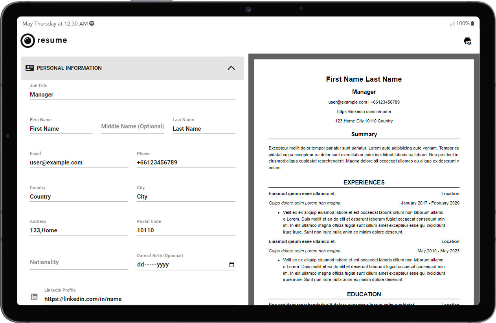

## **SIMPLE RESUME BUIDLER**

https://simpleresume.vercel.app



CREATE: https://simpleresume.vercel.app/#/edit/resume
TIPS : https://hwpi.harvard.edu/files/ocs/files/hes-resume-cover-letter-guide.pdf
___

## **About Project**

---


## Project Setup

```plaintext
npm install
```

### Compile and Hot-Reload for Development

```plaintext
npm run dev
```

### Compile and Minify for Production

```plaintext
npm run build
```

### Run Unit Tests with [Vitest](https://vitest.dev/)

```plaintext
npm run test:unit
```

### Lint with [ESLint](https://eslint.org/)

```plaintext
npm run lint
```

---

## Dockerize Application

Using make to build dockerized application.

Created Makefile in root.

make will run Makefile and build docker application.

Without make,

docker-compose shell scripts are created in ./workflows folder.

#### Docker Build

```plaintext
npm run make-start
```

#### Docker Stop

```plaintext
npm run make-stop
```

#### Docker Clean

```plaintext
npm run make-clean
```

#### Docker Restart Container

```plaintext
npm run make-restart
```

---

